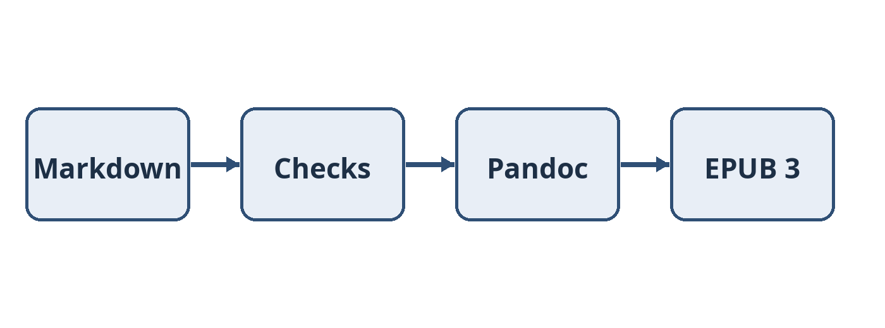

# 1. Why Markdown

*Scenario, a kitchen table, 2031.* The draft lives in a folder of plain text files. Nothing about it depends on one program.

Markdown keeps a manuscript readable as plain text and renders cleanly on GitHub [1]. Pandoc can turn the same files into an EPUB 3 publication [2], the format most ebook stores accept.

> [!NOTE]
> This paragraph is a GitHub alert. In the EPUB it becomes a tinted box with a "Note" label.

## Plain text lasts

A text file written today will open in fifty years.[^durable] The icon  sits inline with this sentence, and its alt text describes it for screen readers.

The image above has a title in its Markdown source, so it becomes a figure with a caption. [Chapter 2](02-structure.md#tables-and-code) shows the other building blocks.

## References

[1]: https://github.github.com/gfm/ "GitHub, GitHub Flavored Markdown Spec, version 0.29-gfm"
[2]: https://pandoc.org/MANUAL.html "John MacFarlane, Pandoc User's Guide"

[^durable]: Plain UTF-8 text is the most durable format a writer can choose.
