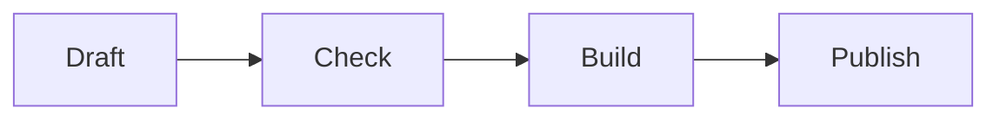

# 2. Structure

Every chapter file starts with one level-1 heading. Sections use `##`, subsections `###`, and levels are never skipped.

## Tables and code

| Element | Markdown | EPUB result |
|---|---|---|
| Table | pipes and dashes | an HTML table |
| Code | three backticks | a preformatted block |
| Math | `$...$` | MathML |

```python
def greet(name):
    return f"Hello, {name}"
```

The area of a circle is $A = \pi r^2$.

## A chart



## A full-page image

The next image fills its own page in the EPUB, because its title starts with `full-page`.


Back to [chapter 1](01-why-markdown.md), or on to [publishing](03-publishing.md).
