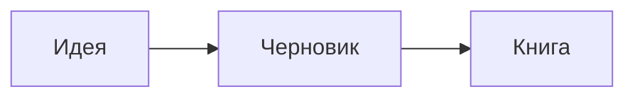

# 1. Начало

*Сцена, Москва, 2031.* Робот открыл дверь — и увидел пустой зал.

## Первые шаги

Проект опирается на справочник [Milchin] и на отчёт NASA [2]. Подробнее о материалах — в [главе 2](02-materialy.md#выбор-материала).

Сноска для проверки.[^1]

***

Вторая сцена после разрыва. Ссылка на внешний сайт: [сайт](https://example.org/page_with_underscores).

## Литература

[Milchin]: https://example.org/milchin "Мильчин А. Э., Чельцова Л. К. Справочник издателя и автора. 2014"
[2]: https://example.org/nasa_report "NASA, Technical Report, 2020"

[^1]: Текст сноски с «кавычками» и — тире.
